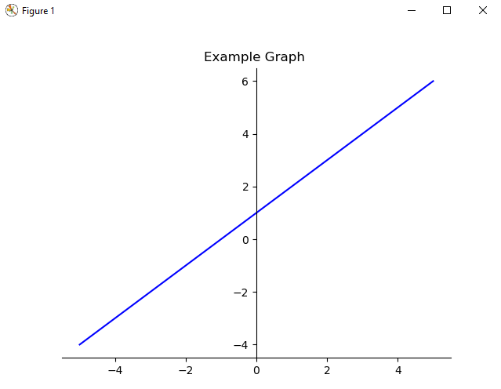

# graphr

## Introduction
graphr is a small language written to create basic mathematical graphs. It is an interpreted language written in python and essentially wraps the matplotlib library using a simple syntax.

<div align="center">
    
</div>

## Installation
Firstly install matplotlib and numpy
```bash
pip install matplotlib numpy
```

Then clone the repo
```bash
git clone https://github.com/swishyy/graphr.git your-project-name
```

Then run the interpreter and pass a .graphr file with it
```bash
cd your-project-name
python interepreter.py file.grapr
```

## Language

$ - Allows for comments.

#### OPTIONS
`TOOLBAR HIDE/SHOW` - Hide or show the toolbar when the graph is rendered. Ommiting this command shows the toolbar by default.

`WARNINGS HIDE/SHOW` - Hide or show warnings in the console when the graph is rendered. Ommiting this command shows the commands by default.

***

#### TITLE
`e.g. TITLE This is a title` - Sets the title of the graph.

#### RANGE
`e.g. RANGE -5 5` - Sets the boundaries for the x-axis on the graph.

#### COLOUR
`e.g. COLOUR blue` - Set the colour of the line. If a colour is not picked, one will be randomly assigned.

#### SCREENSHOT
`e.g. SCREENSHOT graph` - Screenshots the graph and saves it with the filename specified.

#### SHOW 
`e.g. SHOW` - Simply displays the graph, without this command the graph would not be displayed.

## Contributing
All pull requests are welcome let me know if there are any bugs.

## License
[MIT](https://choosealicense.com/licenses/mit/)